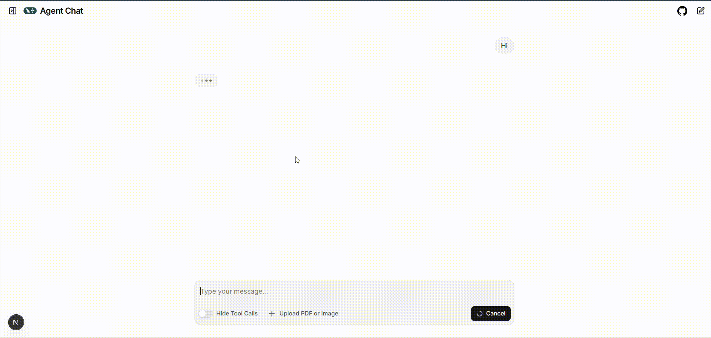
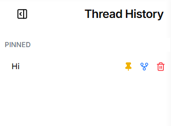
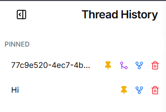

# Agentic Chat

Agentic chat application powered by Langgraph.



### Setup

To setup langgraph dev server:

```bash
pip install -r requirements.txt
```

Create an `.env` file with your variables

```bash
langgraph dev
```

To run the agent-chat-ui do:

```bash
cd agent-chat-ui
```

```bash
npm i
```

```bash
npm run dev
```

### Add-Ons

- [x] Pin favorite threads



- [x] Fork threads




